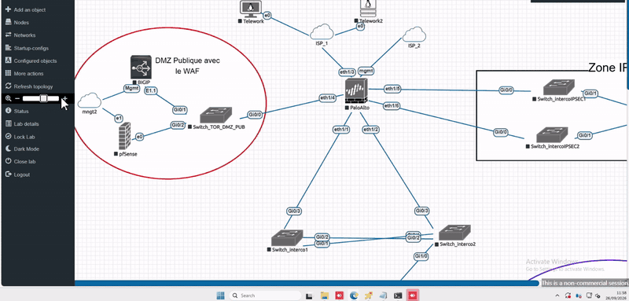
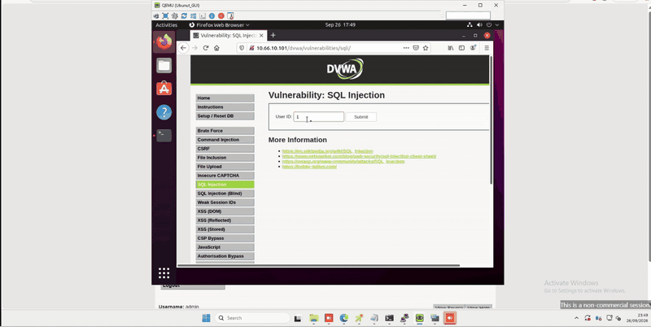
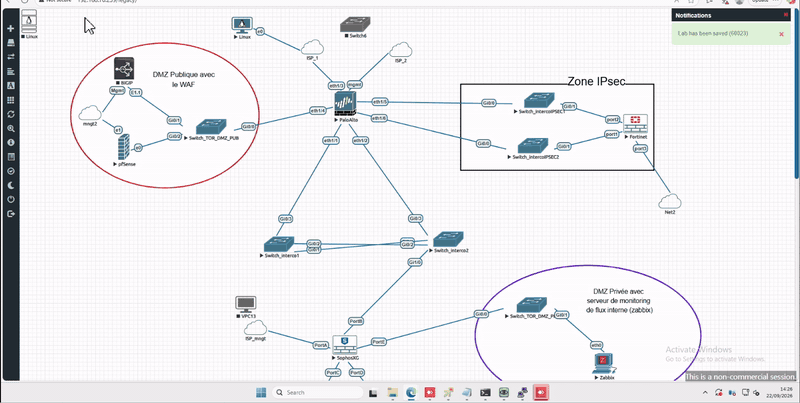
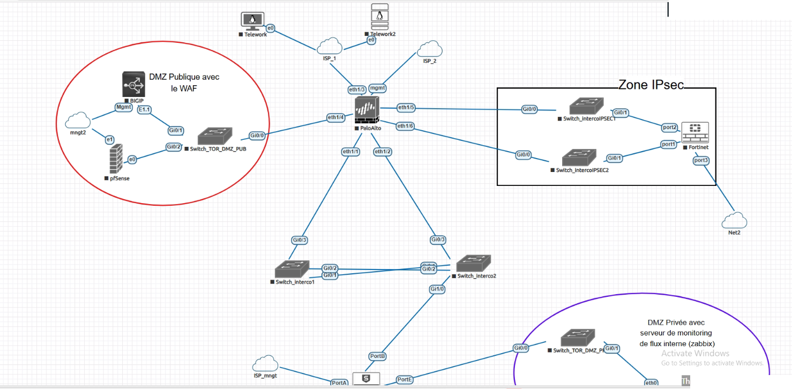
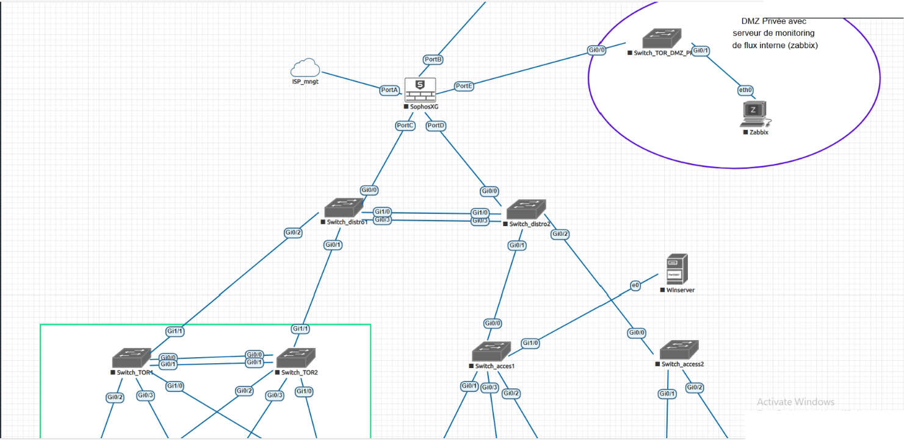
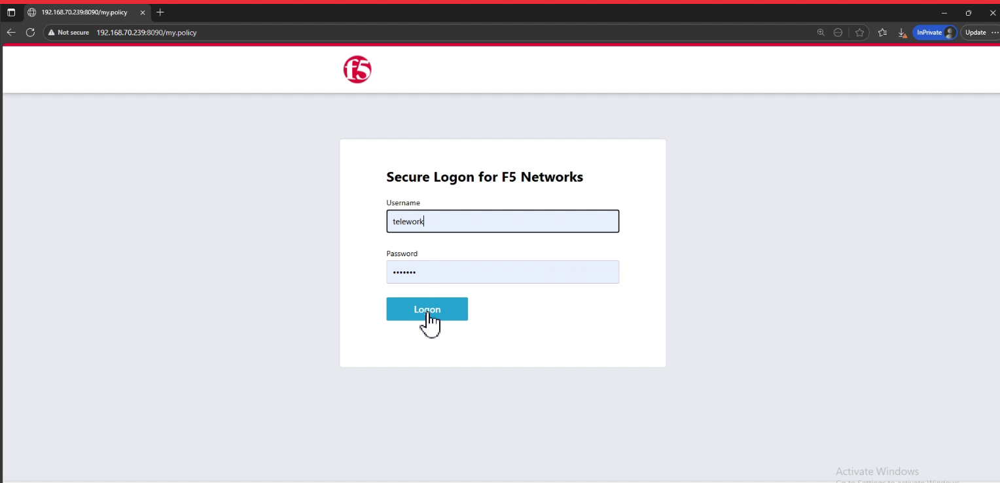
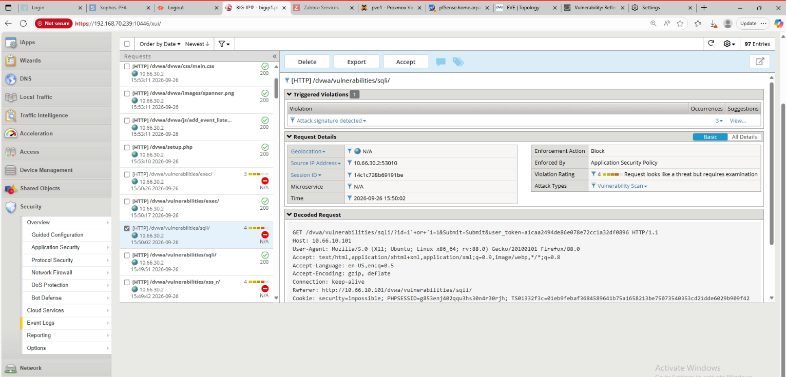

# Laboratoire datacenter multi-couches

[](https://www.eve-ng.net/)
[](https://docs.paloaltonetworks.com/)
[](https://clouddocs.f5.com/)
[](https://docs.sophos.com/)
[](https://docs.fortinet.com/)
[](https://docs.haproxy.org/)
[](https://docs.strongswan.org/)
[]()

**Projet de laboratoire** : concevoir et faire tourner, dans EVE-NG, une architecture datacenter complète (cascade de NGFW, doubles DMZ, commutation hiérarchique, publication HTTP, WAF, annuaire, accès distant).

Le dépôt documente la **démarche**, les **choix**, les **extraits de configuration** et les **preuves**. Il ne contient ni images QEMU constructeur, ni secrets, ni adressage d'un site réel.

## Démo

Le GIF tourne tout seul dans le README (aperçu x2). **Cliquer l'image** ouvre la vidéo MP4 (lecteur GitHub, téléchargement possible).

[](docs/media/demo.mp4)

*Toile EVE-NG : frontal PAN-OS, dorsal SFOS, DMZ publique (BIG-IP / pfSense), zone IPsec Fortinet. [MP4](docs/media/demo.mp4)*

| Preuve | Aperçu GIF | Détail |
|--------|------------|--------|
| WAF Blocking (SQLi / XSS, VIP DVWA) | [](docs/media/demo-waf.gif) | ASM Event Logs, Support ID |
| Télétravail IPsec (strongSwan, Mode Config) | [](docs/media/demo-vpn.gif) | Tunnel ESTABLISHED, VIP `10.66.80.x` |

## Pourquoi ce projet ?

Un schéma mural (un pare-feu, une DMZ, un VIP) ne dit rien sur l'ordre des maillons ni sur ce qui casse quand un NAT, une licence ou un monitor LTM est faux.

L'objectif était de **poser** la chaîne, puis de **prouver** deux choses : un flux légitime passe, une payload d'injection ne passe plus.

| Couche | Rôle | Dans ce lab |
|--------|------|-------------|
| **Périmètre** | Premier filtre, WAN, VPN, DMZ publique | PA-VM (zones, NAT, GlobalProtect / X-Auth) |
| **Dorsal** | Passerelles LAN, DMZ privée | Sophos SFOS (VLAN 20 / 40 / 45 / 50) |
| **Publication** | VIP, persistance, identité, WAF | BIG-IP LTM + APM + ASM ; HAProxy en parallèle |
| **Identité** | Comptes, DNS interne | AD `pfa.local`, DC `10.66.40.10` |
| **Accès distant** | Client depuis le WAN, IP automatique | strongSwan, pool `10.66.80.10` à `.20` |
| **Compute** | Hyperviseurs de lab | Cluster Proxmox 3 nœuds |

## Méthodologie

Même logique que pour un lab IoT : une couche n'est ajoutée que lorsque la précédente répond.

| Phase | Objectif | Résultat |
|-------|----------|----------|
| **1. Toile** | Câbler sans adresses de production | UNL, RFC 1918 `10.66.0.0/16` |
| **2. L2 / L3** | VLAN, EtherChannel, interco | IOSv-L2, STP, canal `mode on` |
| **3. NGFW** | Zones, NAT, une règle par VIP | PAN-OS frontal, SFOS dorsal |
| **4. Publication** | Deux membres HTTP | HAProxy round robin, puis LTM Auto Map |
| **5. Identité** | Formulaire devant le VIP | APM + AD |
| **6. WAF** | Payload bloquée | ASM Transparent puis Blocking (REST `apply-policy`) |
| **7. VPN** | Client WAN, IP automatique | strongSwan, Mode Config |

Preuve retenue : **couple de chemins**, pas une capture isolée (origine DVWA `10.66.50.82` / VIP `10.66.10.101`).

## Architecture (vue d'ensemble)

```text
                    [ Client WAN / Alpine ]
                              |
                         UDP 500/4500
                              v
                 [ PAN-OS  frontal  ]
                   WAN | INTERCO | DMZ_PUB | VPN-RA
                              |
                         VLAN 30
                              v
                 [ SFOS  dorsal  ]
                   LAN 40 | voix 45 | DMZ-PRV 20 | webs 50
                              |
          +-------------------+-------------------+
          v                   v                   v
     [ AD / DNS ]      [ web1 / web2 ]      [ DVWA ]
      10.66.40.10       10.66.50.80/.81      10.66.50.82
                              ^
                              |  SNAT Auto Map
                 [ BIG-IP  10.66.10.10 ]
                   vs_web   10.66.10.100   LTM + APM + ASM Transparent
                   vs_dvwa  10.66.10.101   ASM Blocking
                 [ HAProxy  10.66.10.11:8080 ]
```

Détail des VLAN et des choix : [docs/ARCHITECTURE.md](docs/ARCHITECTURE.md).

## Choix (et pourquoi)

| Décision | Raison |
|----------|--------|
| Palo au bord | App-ID, NAT, IPsec, portail télétravail : le poste le plus exposé |
| Sophos en dorsal | Passerelles LAN / DMZ privée, licence déjà tenable dans l'émulateur |
| Fortinet en pair IPsec | Quota d'interfaces VE : rôle de site, pas le télétravail |
| Auto Map sur le LTM | Les backends ont pour passerelle Sophos ; sans SNAT le pool reste Offline |
| Deux VIP HTTP | APM sur l'applicatif ; Blocking REST sur DVWA, lisible à part |
| HAProxy en parallèle | Même rôle LTM, sans licence F5 |
| RFC 1918 de lab | Journal de configuration distinct d'un plan d'exploitation réel |

Extraits (PSK et mots de passe omis) : [docs/CONFIGS.md](docs/CONFIGS.md).

## Captures

<table>
  <tr>
    <td align="center" width="50%">
      
      <br /><sub><b>Périmètre</b> PAN-OS, Fortinet, DMZ publique</sub>
    </td>
    <td align="center" width="50%">
      
      <br /><sub><b>LAN</b> SFOS, accès, DMZ privée</sub>
    </td>
  </tr>
  <tr>
    <td align="center" width="50%">
      
      <br /><sub><b>APM</b> logon devant <code>vs_web</code></sub>
    </td>
    <td align="center" width="50%">
      
      <br /><sub><b>ASM Blocking</b> injection SQL, Support ID</sub>
    </td>
  </tr>
</table>

## Prérequis (pour reproduire)

### Plateforme

| Élément | Remarque |
|---------|----------|
| EVE-NG Community | Toile QEMU, lab au format UNL |
| Images constructeur | PAN-OS, SFOS, FortiOS, TMOS, IOSv-L2 : **chez l'éditeur**, pas dans ce dépôt |
| RAM hôte | Un BIG-IP VE + 3 NGFW tiennent mal sous 32 Go |

### Plan d'adressage (laboratoire uniquement)

| Réseau | Usage |
|--------|--------|
| `10.66.10.0/24` | DMZ publique, VIP, Self IP ADC |
| `10.66.20.0/24` | DMZ privée (supervision) |
| `10.66.30.0/24` | Interco frontal / dorsal |
| `10.66.40.0/24` | LAN data, AD |
| `10.66.50.0/24` | Serveurs HTTP / DVWA |
| `10.66.80.0/24` | Pool télétravail (Mode Config) |

## Structure du dépôt

| Dossier | Rôle |
|---------|------|
| **`docs/`** | Architecture, extraits de config, médias |
| **`docs/media/`** | GIF (README), MP4 (clic), captures |
| **`configs/`** | Snippets (sans secret) |

## Documentation

| Fichier | Contenu |
|---------|---------|
| [docs/ARCHITECTURE.md](docs/ARCHITECTURE.md) | Agencement des composants, VLAN, flux |
| [docs/CONFIGS.md](docs/CONFIGS.md) | Extraits PAN-OS, LTM, HAProxy, strongSwan |
| [docs/METHOD.md](docs/METHOD.md) | Ordre de construction et preuves |

## Licence

MIT pour le texte, les extraits et les captures de ce dépôt. Les images QEMU et les licences constructeur restent la propriété de leurs éditeurs.
